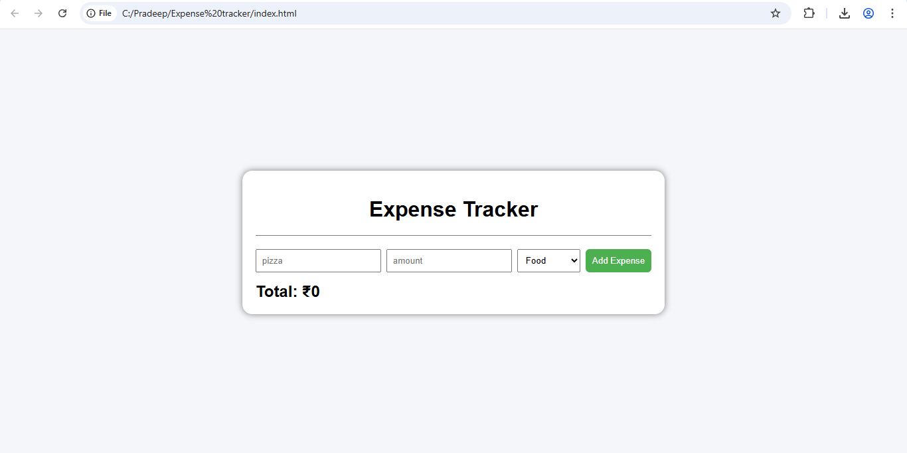
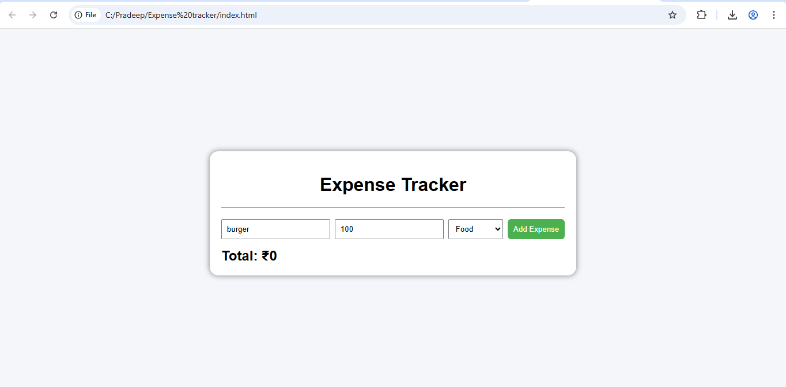
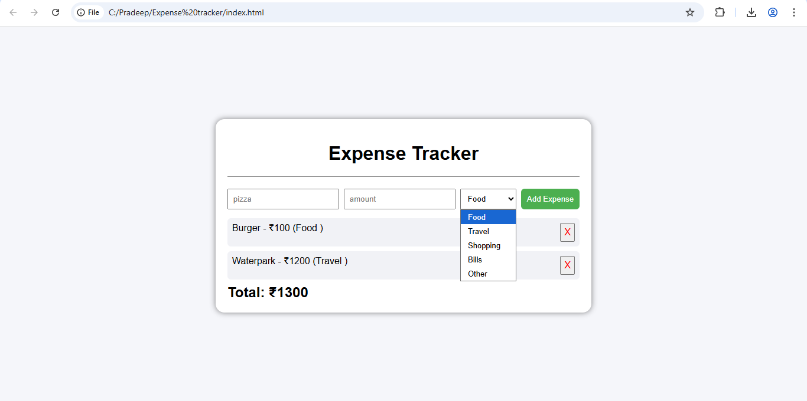
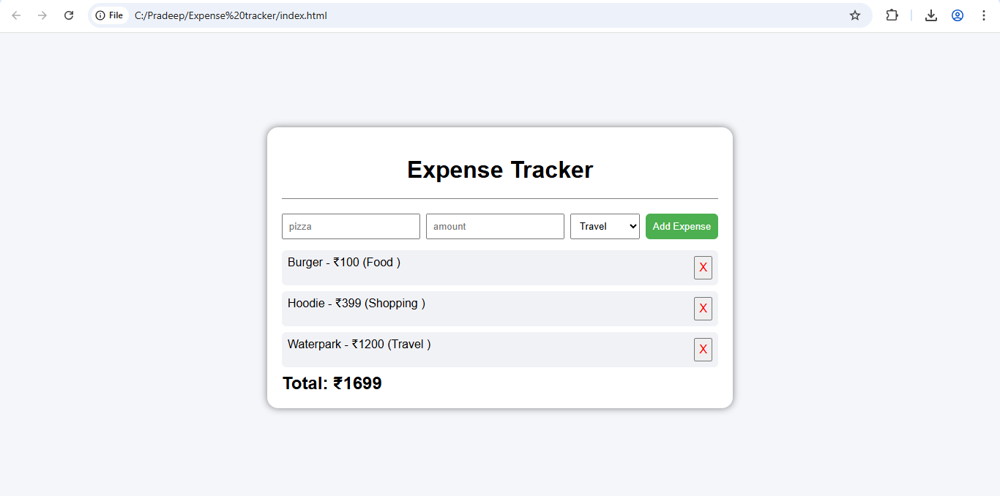
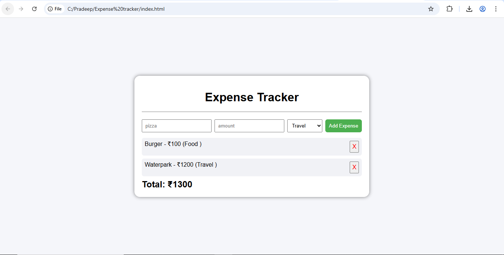

## Expense Tracker App
A simple JavaScript expense tracker that allows users to add, categorize, delete expenses, calculate total spending, and persist data using Local Storage.

## Screenshots

### Landing Page

### Adding Expenses

### Expenses Options

### Total Expenses

### Removing Expenses

